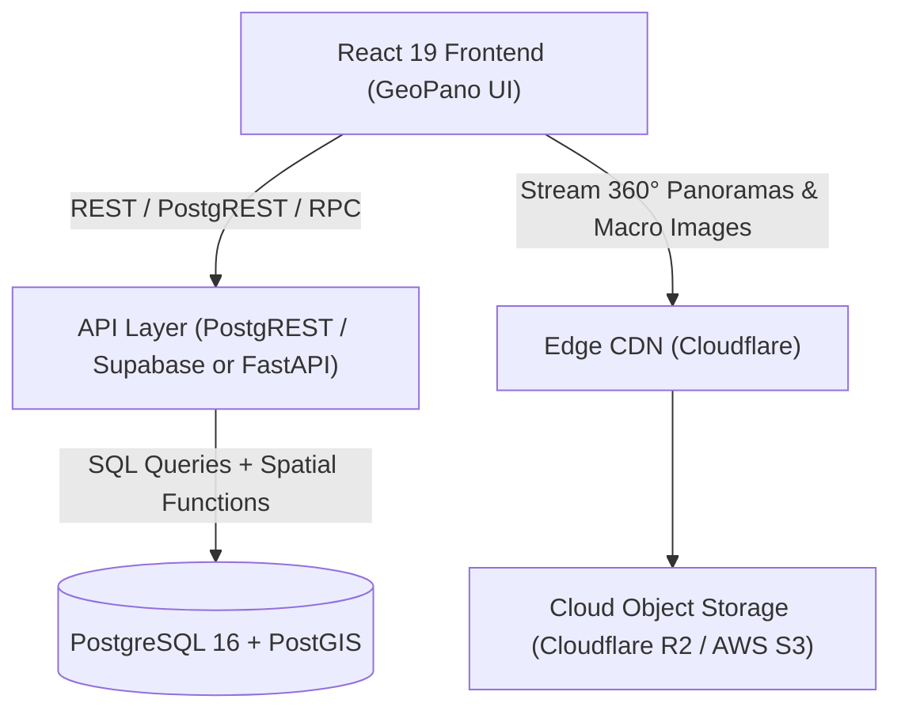

# Implementation Plan: Align GeoPano UI/UX with PostgreSQL Database Schema

This plan audits the relational schema defined in `src/data/csv`, identifies structural and functional UX/UI gaps in the existing frontend, and proposes a complete implementation strategy along with a professional PostgreSQL + PostGIS architecture setup.

---

## 0. Status — UX/UI Foundation (completed 2026-09-19)

A round of UX/UI remediation was completed **before** any database work, concentrated on mobile. It is
prerequisite groundwork rather than schema work: everything below adds fields and panels to screens
that now behave correctly on touch devices. No data modelling was changed.

### 0.1 Rendering & layout defects fixed

| Defect | Root cause | Resolution |
| :--- | :--- | :--- |
| Map scale bar never rendered | Leaflet sets `.leaflet-pane { z-index: 400 }`. Neither the map `<div>` nor `<main>` created a stacking context, so tiles painted over overlays sitting at `z-index: 50` | Map container given `zIndex: 0` (traps Leaflet's internal panes); scale bar raised to `450` |
| Footer pushed past the fold on mobile | `minHeight: 100vh` beat `height: 100dvh` — `min-height` always wins | `minHeight` switched to `100dvh` on fixed-layout views |
| Compass / yaw / pitch invisible on mobile | `openAnn` comes from `Array.find()`, which yields `undefined`, but was tested `!== null` — always true | Test changed to `!!openAnn` |
| "Pick on map" reset the viewport | The Leaflet init effect depended on `pickingMode`, and its cleanup called `map.remove()` | `pickingMode` read through a ref; effect is now mount-once |

### 0.2 Mobile usability

- **Unified breakpoint** — `MOBILE_BREAKPOINT = 768` in `useWindowWidth.ts`, mirrored by `@media (max-width: 768px)`. The viewer previously used 640 while everything else used 768, producing a broken 640–767px band.
- **Touch targets** — map pins 14 → 24–30px (Leaflet's hit area equals the icon size), rail/zoom/layers 40 → 44px, hamburger 38 → 44px, `.gp-ctrl-btn-sm` 28 → 44px (it had been *smaller* on touch than on desktop). `closeBtn` is 32px; reaching 44px needs panel headers reflowed.
- **iOS zoom trap** — every mobile input raised to 16px. Below that Safari zooms on focus and never zooms back, which was unescapable on the full-viewport map.
- **Safe areas** — `viewport-fit=cover` added, activating the `env(safe-area-inset-*)` rules that were already written but resolving to `0`.
- **Bottom sheets** — `33.33vh` → `max(38dvh, 300px)` capped at `70dvh`, plus safe-area padding and `overscroll-behavior: contain`.
- **Dismissal** — Escape on both map and viewer (innermost-first); tap-outside backdrop on mobile map sheets.
- **Feedback** — both `window.alert()` calls replaced with in-design toasts (`role="status"`, auto-dismiss).
- **Accessibility** — global `:focus-visible` ring; `#9AA39E` / `#7B8380` → `#5A635F` (≈2.5:1 and ≈3.8:1 → ≈5:1); 8–9px text raised to a 10–11px floor.
- **Graceful WebGL failure** — `supportsWebGL()` probe added. Pannellum swallows WebGL errors and renders its own black panel, so the app's branded fallback never fired. Landing now falls back to a flat preview image; the viewer shows its hardware-acceleration card.

### 0.3 Complete camera state — `{yaw, pitch, hfov}`

Share links previously carried only `yaw` and `pitch`, so a recipient landed pointing the right way but
framed wrong — the difference between "the outcrop" and "this 30 cm contact". **`hfov` (zoom) is now
carried end-to-end**: `shareView()`, `parseHash`/`buildHash`, and the `initialHfov` prop. Links without
`hfov` fall through to the default, so older links keep working.

**View bookmarks** were added on the same shape, stored at `geopano_bookmark_<stopId>` in localStorage:
toggle to save/clear, restored on load with precedence **URL params > bookmark > stop default**.

> ⚠️ **Unverified in a browser.** All of section 0 is confirmed only by `npx tsc --noEmit` and
> `npm run build`. The bookmark toggle, Escape handling, and pick-on-map behaviour are behavioural
> and still need a manual click-through.

---

## 1. Audit & Gap Analysis: CSV Schema vs Current Frontend

The CSV files in `src/data/csv` describe a normalized relational database schema with 7 tables:

| CSV Table | Primary Key | Foreign Keys | Key Attributes & Capabilities | Current UI/UX Status in Code |
| :--- | :--- | :--- | :--- | :--- |
| **`paths.csv`** | `path_id` | `creator_id` | `path_title`, `description`, `region`, `country`, `cover_image`, `status` ('published'\|'draft') | Missing `region`, `country`, `cover_image`, `status`, `creator_id`. Uses hardcoded CSS gradient backgrounds. |
| **`stops.csv`** | `stop_id` | `path_id`, `creator_id` | `image_360`, `thumbnail`, `file_size`, `image_width`, `image_height`, `lat`, `lng`, `altitude`, `default_yaw`, `default_pitch`, `default_fov`, `north_yaw`, `horizon_pitch`, `roll`, `projection_type`, `sort_order`, `status` | Missing `altitude`, `horizon_pitch`, `roll`, `file_size`, `image_width/height`, `thumbnail`, `sort_order`, `status`. **`default_fov` and `north_yaw` now have live UI counterparts** (`startHfov` and `northHeading`) but read from localStorage rather than the DB — a *migration* task, not a build task. See §2.4. |
| **`annotations.csv`** | `annotation_id` | `stop_id`, `creator_id` | `title`, `type` ('observation', etc.), `note`, `yaw`, `pitch`, `icon`, `status` | Uses frontend-only `kind` ('point'\|'line'\|'polygon') and ignores `type`, `status`, and `icon`. |
| **`annotation_images.csv`** | `image_id` | `annotation_id` (1:N) | `image_url`, `caption`, `alt_text`, `sort_order` | **Completely missing in UI**: Close-up macro photos, hand-specimen photos, and thin sections cannot be viewed or attached. |
| **`annotation_references.csv`** | `reference_id` | `annotation_id` (1:N) | `title`, `url`, `source`, `accessed_date` | Only rudimentary single string `refLink` and `refLabel` exist; no support for structured multi-citations with sources and dates. |
| **`collections.csv`** | `collection_id` | `creator_id` | `collection_title`, `description`, `visibility` ('public'\|'private') | **Completely missing in UI**: No way to view or organize field trip collections/sets. |
| **`collection_items.csv`** | `collection_item_id` | `collection_id`, polymorphic (`item_type`, `item_id`) | `item_type` ('path'\|'stop'\|'annotation'), `item_id`, `note` (curator commentary), `sort_order`, `added_date` | **Completely missing in UI**: No bookmarking, no curation view, no teacher/student sets. |

---

## 2. Professional PostgreSQL Architecture Recommendation

For a high-performance geological spatial platform, the following setup is recommended:



### 2.1 Database Layer (PostgreSQL + PostGIS)
- **Extension**: `CREATE EXTENSION IF NOT EXISTS postgis;`
- **Spatial Data**: Store stop coordinates as `GEOMETRY(PointZ, 4326)` to natively support latitude, longitude, and elevation (`altitude`).
- **Spatial Indexing**: Add `CREATE INDEX idx_stops_geom ON stops USING GIST (geom);` for fast bounding-box queries on the map (`ST_MakeEnvelope`).
- **Row-Level Security (RLS)**: Enforce public vs draft visibility (`status = 'published'` for public read, creator access for drafts) and private vs public collections.

### 2.2 Recommended Backend Stack Options
1. **Option A: Supabase (Recommended for speed & modern DX)**
   - Managed PostgreSQL 16 + PostGIS.
   - Built-in PostgREST generating instant type-safe CRUD endpoints from tables.
   - S3-compatible Storage for equirectangular 360° panoramas and annotation close-up images.
   - Native TypeScript type generation (`supabase gen types typescript`).
2. **Option B: FastAPI + SQLAlchemy / GeoAlchemy2 (Recommended for Python Geospatial integrations)**
   - Seamless integration with Python geospatial libraries (GDAL, Rasterio, Shapely) for DEM elevation sampling, geological strike/dip calculations, and automated metadata extraction.

### 2.3 Media & Asset Storage Pipeline
- Equirectangular 8K panoramas (~15-25 MB) stored on S3 / Cloudflare R2 with global edge caching.
- Sharp/libvips pipeline generating:
  - Low-res progressive preview (`512px`, ~25 KB) for instant visual feedback.
  - Standard responsive thumbnails (`400px` webp) for path and stop cards.
  - Multi-resolution deep zoom / cubemap tiles for ultra-fast mobile streaming.

### 2.4 Three distinct scopes that currently look identical

The frontend holds three concepts that all read as "bookmarking" but belong in different places.
They are indistinguishable today because two of them sit in the same browser-local bucket — a
distinction that becomes a schema decision the moment a backend exists.

| Concept | Scope | Stored today | Belongs |
| :--- | :--- | :--- | :--- |
| **`north_yaw`** (compass calibration) | **Per panorama** — one objectively correct value, identical for every viewer | `geopano_north_<stopId>` (localStorage) | column on `stops` |
| **View bookmark** (`{yaw, pitch, hfov}`) | **Per user** — where *I* was looking | `geopano_bookmark_<stopId>` (localStorage) | new user-scoped table |
| **`collection_items`** (curation) | **Per user** — "save this stop to a set" | not built | existing table (§1) |

**Getting the first row wrong is the expensive mistake.** Treat north calibration as user data and
every user must re-calibrate each panorama themselves. Treat it as global without access control and
one user's calibration silently overwrites everyone's.

#### Proposed table for view bookmarks

```sql
CREATE TABLE view_bookmarks (
  bookmark_id  uuid PRIMARY KEY DEFAULT gen_random_uuid(),
  user_id      uuid NOT NULL REFERENCES users(user_id) ON DELETE CASCADE,
  stop_id      text NOT NULL REFERENCES stops(stop_id) ON DELETE CASCADE,
  yaw          real NOT NULL,
  pitch        real NOT NULL,
  hfov         real NOT NULL,   -- zoom; without it a restored view is framed wrong
  created_date timestamptz NOT NULL DEFAULT now(),
  UNIQUE (user_id, stop_id)     -- current UI is one bookmark per stop
);
```

The `UNIQUE` constraint encodes today's behaviour (toggle on/off, one per stop). Dropping it later
allows multiple named bookmarks per stop without a rewrite.

#### Migration: `north_yaw`

Users may already hold `geopano_north_<stopId>` values that disagree with the DB. Decide the
precedence before writing the loader — this is a genuine product question, not a technical one:

1. **DB always wins** — simplest; silently discards local calibration work.
2. **Local wins until the user clears it** — preserves effort; users diverge invisibly from the canonical value.
3. **Prompt on conflict** — correct, most work.

The same question applies to `default_fov` vs. a saved view bookmark, though the stakes are lower
there since the current precedence (**URL > bookmark > stop default**) already resolves it sensibly.

---

## 3. Proposed Changes

### Component 1: Data Model & Normalized Types

#### [MODIFY] [types.ts](file:///e:/github/digitalgeosciences/geopano/src/types.ts)
- Update TypeScript types to match the PostgreSQL schema:
  - `Path`: Add `path_title`, `description`, `region`, `country`, `cover_image`, `status`, `creator_id`, `creation_date`, `updated_date` (maintaining backward-compatible getters for legacy fields).
  - `Stop`: Add `altitude`, `north_yaw`, `horizon_pitch`, `roll`, `default_fov`, `file_size`, `image_width`, `image_height`, `thumbnail`, `sort_order`, `status`.
  - `AnnotationImage`: New interface (`image_id`, `annotation_id`, `image_url`, `caption`, `alt_text`, `sort_order`).
  - `AnnotationReference`: New interface (`reference_id`, `annotation_id`, `title`, `url`, `source`, `accessed_date`).
  - `Annotation`: Add `type`, `status`, `icon`, `images: AnnotationImage[]`, `references: AnnotationReference[]`.
  - `Collection`: New interface (`collection_id`, `collection_title`, `description`, `creator_id`, `creation_date`, `updated_date`, `visibility`).
  - `CollectionItem`: New interface (`collection_item_id`, `collection_id`, `item_type`, `item_id`, `note`, `sort_order`, `added_date`).

#### [NEW] [dbSchema.sql](file:///e:/github/digitalgeosciences/geopano/src/data/dbSchema.sql)
- Production-ready PostgreSQL DDL script with PostGIS types, foreign keys, check constraints, indexes, and seed-ready statements.

#### [NEW] [csvDataLoader.ts](file:///e:/github/digitalgeosciences/geopano/src/data/csvDataLoader.ts)
- Universal relational data loader that parses the CSV files in `src/data/csv/` into fully joined, typed data structures.
- Intelligently maps the CSV data to the existing mock panorama files in `public/uploads/` so all stops load real interactive 360° panoramas out of the box.

#### [MODIFY] [pathsData.ts](file:///e:/github/digitalgeosciences/geopano/src/data/pathsData.ts)
- Integrate the CSV relational data loader as the primary data source while maintaining localStorage custom edits/drafts.
- Provide helper methods for Collections: `getCollections()`, `getCollectionItems(collectionId)`, `addToCollection()`, `removeFromCollection()`.

---

### Component 2: Library Page UX/UI Upgrade

#### [MODIFY] [Library.tsx](file:///e:/github/digitalgeosciences/geopano/src/pages/Library.tsx)
- Add **"Collections"** filter tab alongside "All", "Paths", "Stops", "Annotations".
- Render rich Collection Cards:
  - Collection title, curator name/ID, visibility badge (Public / Private).
  - Item count badge (e.g., "3 items: 2 stops · 1 annotation").
  - Curator description and notes.
- When opening a Collection, display the curated stops, annotations, and paths with the curator's specific field note.
- Enhance Stop & Path cards:
  - Display `region` and `country` (e.g. "Eastern Province, Saudi Arabia").
  - Display `altitude` badge (e.g. "Elev. 42.5 m").
  - Display `status` badge (Published vs Draft).
  - Show photo count and reference citation count indicators.

---

### Component 3: 360° StopViewer UX/UI Upgrade

#### [MODIFY] [StopViewer.tsx](file:///e:/github/digitalgeosciences/geopano/src/pages/StopViewer.tsx)
- **Annotation Photo Gallery (`annotation_images`)**:
  - When an annotation is selected, render a carousel/grid of attached close-up macro outcrop photos with captions and modal lightbox zoom.
- **Structured Bibliographic References (`annotation_references`)**:
  - Render citations cleanly with source badge, external link, and accessed date.
- **Geological & Spatial Alignment Banner**:
  - Show Stop `altitude` (elevation in meters ASL).
  - Use `north_yaw` from the database to initialize and calibrate True North on the compass. The compass UI already exists and persists to localStorage — this is a **source swap plus migration**, see §2.4.
  - Feed `default_fov` into `startHfov` so a stop opens at its intended zoom. The precedence chain is already implemented: **URL params > view bookmark > stop default**.
  - Display image technical specs (e.g., "8192 × 4096 px · 18.5 MB").
- **Collection Bookmark Action** — ⚠️ *naming collision*:
  - Add a "Save to Collection" button on stops and annotations allowing users to assign items to existing collections or create a new collection.
  - This is **curation** and is unrelated to the **view bookmark** already shipped in this viewer (§0.3), which saves a camera orientation. Both would otherwise be bookmark icons in the same control cluster meaning different things.
  - Recommendation: keep the ribbon/bookmark icon for *view* bookmarks and give collections a distinct affordance — a folder/plus icon, or a labelled "Save to…" button rather than a bare icon.
- **Annotation geometry stays `yaw`/`pitch` only.** A point on a rock face is a *direction* and has no zoom. Only *camera state* takes `hfov`. Conflating the two will corrupt the annotation schema.
- **Updated Annotation Form**:
  - Allow adding close-up photo URLs/uploads and citation references directly when creating or editing an annotation.

---

### Component 4: Map Page UX/UI Alignment

#### [MODIFY] [MapPage.tsx](file:///e:/github/digitalgeosciences/geopano/src/pages/MapPage.tsx)
- Display `altitude` (meters) in stop marker popups and stop drawer.
- Display `region`, `country`, and `status` badges (Draft vs Published).
- Add filter option to show items from a specific Collection.

---

## 4. Verification Plan

### Automated Verification
- Run TypeScript type checks: `npx tsc --noEmit` to verify type safety across all modified files.
- Run build verification: `npm run build` to ensure all bundle assets and components compile cleanly.

### Manual / Browser Verification
- Open the application in browser (`http://localhost:8443/geopano/`):
  1. **Library Page**: Check the new "Collections" tab, verify "Carbonate Features" and "Field Trip Favorites" load correctly with their curated items and notes.
  2. **StopViewer Page**: Navigate to `stop-001` or `sp00001` and verify:
     - Close-up annotation image gallery renders (e.g., bedding close-up).
     - Scientific references render with source details and links.
     - Altitude and compass calibration match DB fields.
     - "Save to Collection" works.
  3. **Map Page**: Verify stop popups show elevation, region, and country.
  4. **Responsive Check**: Test desktop and mobile layouts for panels and modals.

### Outstanding Verification — §0 Foundation Work

Section 0 is confirmed by `tsc --noEmit` and `npm run build` only; none of it has been exercised in a
browser. These checks are prerequisites for trusting the schema work layered on top:

| Check | Expected |
| :--- | :--- |
| `#/map` at desktop width | Scale bar visible bottom-left (it was painted over by Leaflet tiles) |
| `#/stop/…` at <768px | Compass, yaw and pitch all visible when no panel is open |
| Window at ~700px wide | Viewer and Add-Stop modal use the *mobile* layout — this band previously rendered a broken hybrid |
| "Pick on map" | Map holds its position; must **not** snap back to the Arabian Peninsula default |
| Bookmark → reload | Viewer reopens at the saved yaw/pitch/**zoom** |
| Share link → new tab | Framing matches the sender's, not just the direction |
| Old share link (no `hfov`) | Still resolves, falling back to the default zoom |
| iOS Safari, focus any input | No viewport zoom on focus |
| Escape, and tap-outside on mobile | Closes panels innermost-first |

### Known Deferred Items

- `closeBtn` is 32px, short of the 44px touch-target guideline — reaching it requires reflowing the panel headers it sits in.
- **Tier 3 UX items not actioned**: hover states are `onMouseEnter`/`onMouseLeave` inline and therefore dead on touch, with no `:active` press feedback; Library cards are click-handling `div`s without `role`/`tabIndex`; `useWindowWidth` re-renders on every resize pixel rather than only at breakpoint crossings. Each is a real refactor rather than a targeted fix.
- **WebGL** is unavailable in the current dev environment (hardware acceleration disabled), so panoramas render as flat fallbacks locally. This is environmental — the viewer paths above cannot be fully verified until it is re-enabled.
