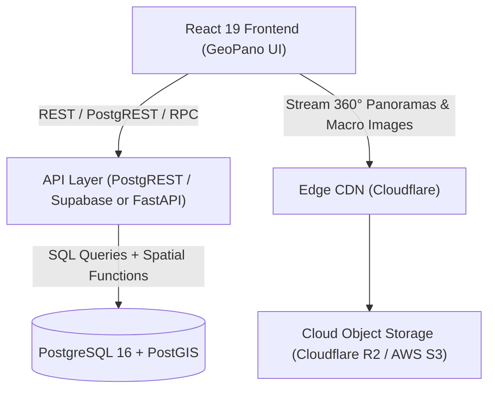

# Implementation Plan: Align GeoPano UI/UX with PostgreSQL Database Schema

This plan audits the relational schema defined in `src/data/csv`, identifies structural and functional UX/UI gaps in the existing frontend, and proposes a complete implementation strategy along with a professional PostgreSQL + PostGIS architecture setup.

---

## 1. Audit & Gap Analysis: CSV Schema vs Current Frontend

The CSV files in `src/data/csv` describe a normalized relational database schema with 7 tables:

| CSV Table | Primary Key | Foreign Keys | Key Attributes & Capabilities | Current UI/UX Status in Code |
| :--- | :--- | :--- | :--- | :--- |
| **`paths.csv`** | `path_id` | `creator_id` | `path_title`, `description`, `region`, `country`, `cover_image`, `status` ('published'\|'draft') | Missing `region`, `country`, `cover_image`, `status`, `creator_id`. Uses hardcoded CSS gradient backgrounds. |
| **`stops.csv`** | `stop_id` | `path_id`, `creator_id` | `image_360`, `thumbnail`, `file_size`, `image_width`, `image_height`, `lat`, `lng`, `altitude`, `default_yaw`, `default_pitch`, `default_fov`, `north_yaw`, `horizon_pitch`, `roll`, `projection_type`, `sort_order`, `status` | Missing `altitude`, `north_yaw` persistence from DB, `horizon_pitch`, `roll`, `default_fov`, `file_size`, `image_width/height`, `thumbnail`, `sort_order`, `status`. |
| **`annotations.csv`** | `annotation_id` | `stop_id`, `creator_id` | `title`, `type` ('observation', etc.), `note`, `yaw`, `pitch`, `icon`, `status` | Uses frontend-only `kind` ('point'\|'line'\|'polygon') and ignores `type`, `status`, and `icon`. |
| **`annotation_images.csv`** | `image_id` | `annotation_id` (1:N) | `image_url`, `caption`, `alt_text`, `sort_order` | **Completely missing in UI**: Close-up macro photos, hand-specimen photos, and thin sections cannot be viewed or attached. |
| **`annotation_references.csv`** | `reference_id` | `annotation_id` (1:N) | `title`, `url`, `source`, `accessed_date` | Only rudimentary single string `refLink` and `refLabel` exist; no support for structured multi-citations with sources and dates. |
| **`collections.csv`** | `collection_id` | `creator_id` | `collection_title`, `description`, `visibility` ('public'\|'private') | **Completely missing in UI**: No way to view or organize field trip collections/sets. |
| **`collection_items.csv`** | `collection_item_id` | `collection_id`, polymorphic (`item_type`, `item_id`) | `item_type` ('path'\|'stop'\|'annotation'), `item_id`, `note` (curator commentary), `sort_order`, `added_date` | **Completely missing in UI**: No bookmarking, no curation view, no teacher/student sets. |

---

## 2. Professional PostgreSQL Architecture Recommendation

For a high-performance geological spatial platform, the following setup is recommended:

### 2.1 Database Layer (PostgreSQL + PostGIS)
- **Extension**: `CREATE EXTENSION IF NOT EXISTS postgis;`
- **Spatial Data**: Store stop coordinates as `GEOMETRY(PointZ, 4326)` to natively support latitude, longitude, and elevation (`altitude`).
- **Spatial Indexing**: Add `CREATE INDEX idx_stops_geom ON stops USING GIST (geom);` for fast bounding-box queries on the map (`ST_MakeEnvelope`).
- **Row-Level Security (RLS)**: Enforce public vs draft visibility (`status = 'published'` for public read, creator access for drafts) and private vs public collections.

### 2.2 Recommended Backend Stack Options
1. **Option A: Supabase (Recommended for speed & modern DX)**
   - Managed PostgreSQL 16 + PostGIS.
   - Built-in PostgREST generating instant type-safe CRUD endpoints from tables.
   - S3-compatible Storage for equirectangular 360° panoramas and annotation close-up images.
   - Native TypeScript type generation (`supabase gen types typescript`).
2. **Option B: FastAPI + SQLAlchemy / GeoAlchemy2 (Recommended for Python Geospatial integrations)**
   - Seamless integration with Python geospatial libraries (GDAL, Rasterio, Shapely) for DEM elevation sampling, geological strike/dip calculations, and automated metadata extraction.

### 2.3 Media & Asset Storage Pipeline
- Equirectangular 8K panoramas (~15-25 MB) stored on S3 / Cloudflare R2 with global edge caching.
- Sharp/libvips pipeline generating:
  - Low-res progressive preview (`512px`, ~25 KB) for instant visual feedback.
  - Standard responsive thumbnails (`400px` webp) for path and stop cards.
  - Multi-resolution deep zoom / cubemap tiles for ultra-fast mobile streaming.

---

## 3. Proposed Changes

### Component 1: Data Model & Normalized Types

#### [MODIFY] [types.ts](file:///e:/github/digitalgeosciences/geopano/src/types.ts)
- Update TypeScript types to match the PostgreSQL schema:
  - `Path`: Add `path_title`, `description`, `region`, `country`, `cover_image`, `status`, `creator_id`, `creation_date`, `updated_date` (maintaining backward-compatible getters for legacy fields).
  - `Stop`: Add `altitude`, `north_yaw`, `horizon_pitch`, `roll`, `default_fov`, `file_size`, `image_width`, `image_height`, `thumbnail`, `sort_order`, `status`.
  - `AnnotationImage`: New interface (`image_id`, `annotation_id`, `image_url`, `caption`, `alt_text`, `sort_order`).
  - `AnnotationReference`: New interface (`reference_id`, `annotation_id`, `title`, `url`, `source`, `accessed_date`).
  - `Annotation`: Add `type`, `status`, `icon`, `images: AnnotationImage[]`, `references: AnnotationReference[]`.
  - `Collection`: New interface (`collection_id`, `collection_title`, `description`, `creator_id`, `creation_date`, `updated_date`, `visibility`).
  - `CollectionItem`: New interface (`collection_item_id`, `collection_id`, `item_type`, `item_id`, `note`, `sort_order`, `added_date`).

#### [NEW] [dbSchema.sql](file:///e:/github/digitalgeosciences/geopano/src/data/dbSchema.sql)
- Production-ready PostgreSQL DDL script with PostGIS types, foreign keys, check constraints, indexes, and seed-ready statements.

#### [NEW] [csvDataLoader.ts](file:///e:/github/digitalgeosciences/geopano/src/data/csvDataLoader.ts)
- Universal relational data loader that parses the CSV files in `src/data/csv/` into fully joined, typed data structures.
- Intelligently maps the CSV data to the existing mock panorama files in `public/uploads/` so all stops load real interactive 360° panoramas out of the box.

#### [MODIFY] [pathsData.ts](file:///e:/github/digitalgeosciences/geopano/src/data/pathsData.ts)
- Integrate the CSV relational data loader as the primary data source while maintaining localStorage custom edits/drafts.
- Provide helper methods for Collections: `getCollections()`, `getCollectionItems(collectionId)`, `addToCollection()`, `removeFromCollection()`.

---

### Component 2: Library Page UX/UI Upgrade

#### [MODIFY] [Library.tsx](file:///e:/github/digitalgeosciences/geopano/src/pages/Library.tsx)
- Add **"Collections"** filter tab alongside "All", "Paths", "Stops", "Annotations".
- Render rich Collection Cards:
  - Collection title, curator name/ID, visibility badge (Public / Private).
  - Item count badge (e.g., "3 items: 2 stops · 1 annotation").
  - Curator description and notes.
- When opening a Collection, display the curated stops, annotations, and paths with the curator's specific field note.
- Enhance Stop & Path cards:
  - Display `region` and `country` (e.g. "Eastern Province, Saudi Arabia").
  - Display `altitude` badge (e.g. "Elev. 42.5 m").
  - Display `status` badge (Published vs Draft).
  - Show photo count and reference citation count indicators.

---

### Component 3: 360° StopViewer UX/UI Upgrade

#### [MODIFY] [StopViewer.tsx](file:///e:/github/digitalgeosciences/geopano/src/pages/StopViewer.tsx)
- **Annotation Photo Gallery (`annotation_images`)**:
  - When an annotation is selected, render a carousel/grid of attached close-up macro outcrop photos with captions and modal lightbox zoom.
- **Structured Bibliographic References (`annotation_references`)**:
  - Render citations cleanly with source badge, external link, and accessed date.
- **Geological & Spatial Alignment Banner**:
  - Show Stop `altitude` (elevation in meters ASL).
  - Use `north_yaw` from the database to initialize and calibrate True North on the compass.
  - Display image technical specs (e.g., "8192 × 4096 px · 18.5 MB").
- **Collection Bookmark Action**:
  - Add a "Save to Collection" button on stops and annotations allowing users to assign items to existing collections or create a new collection.
- **Updated Annotation Form**:
  - Allow adding close-up photo URLs/uploads and citation references directly when creating or editing an annotation.

---

### Component 4: Map Page UX/UI Alignment

#### [MODIFY] [MapPage.tsx](file:///e:/github/digitalgeosciences/geopano/src/pages/MapPage.tsx)
- Display `altitude` (meters) in stop marker popups and stop drawer.
- Display `region`, `country`, and `status` badges (Draft vs Published).
- Add filter option to show items from a specific Collection.

---

## 4. Verification Plan

### Automated Verification
- Run TypeScript type checks: `npx tsc --noEmit` to verify type safety across all modified files.
- Run build verification: `npm run build` to ensure all bundle assets and components compile cleanly.

### Manual / Browser Verification
- Open the application in browser (`http://localhost:8443/geopano/`):
  1. **Library Page**: Check the new "Collections" tab, verify "Carbonate Features" and "Field Trip Favorites" load correctly with their curated items and notes.
  2. **StopViewer Page**: Navigate to `stop-001` or `sp00001` and verify:
     - Close-up annotation image gallery renders (e.g., bedding close-up).
     - Scientific references render with source details and links.
     - Altitude and compass calibration match DB fields.
     - "Save to Collection" works.
  3. **Map Page**: Verify stop popups show elevation, region, and country.
  4. **Responsive Check**: Test desktop and mobile layouts for panels and modals.
